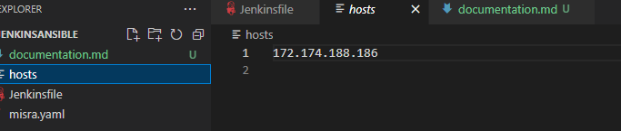
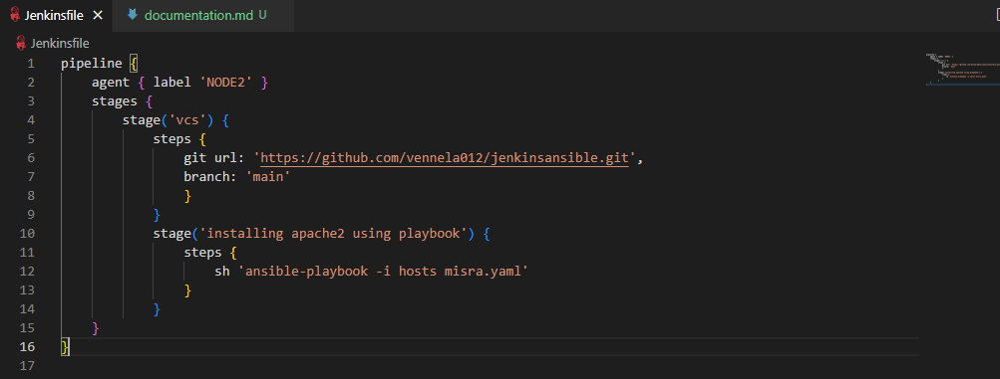
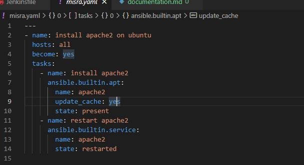

## Install apache2 on ubuntu
--------------------------

* installing jenkins and ansible
* write playbook for apache2 and    call for to jenkins declarative pipelines
* installing jenkins

```

sudo apt update
sudo apt install openjdk-11-jdk
curl -fsSL https://pkg.jenkins.io/debian-stable/jenkins.io.key | sudo tee \
/usr/share/keyrings/jenkins-keyring.asc > /dev/null
echo deb [signed-by=/usr/share/keyrings/jenkins-keyring.asc] \
[preview]https://pkg.jenkins.io/debian-stable binary/ | sudo tee \
/etc/apt/sources.list.d/jenkins.list > /dev/null
sudo apt-get update
sudo apt-get install jenkins
configure jenkins nodes
write declarative pipeline for apache2


```

* ansible installation
```

sudo apt update 
sudo apt install ansible -y
make sure that adduser to master and node and after that give passwdless authentication permissions to both
ssh keygen and add node publickey(i.e different region) and private key(i.e same region)to master
configure the hosts
* playbook

```
* 
* 
* 
## Git 
create new repository
[git url] https://github.com/vennela012/jenkinsansible.git)
push the code into remote repository 


